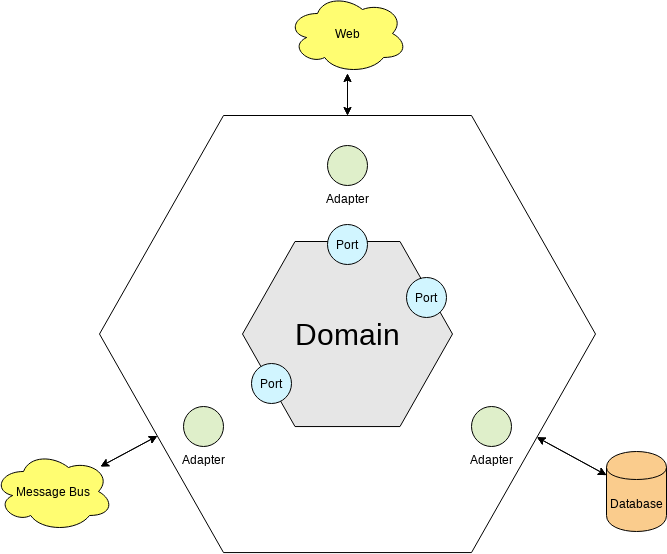
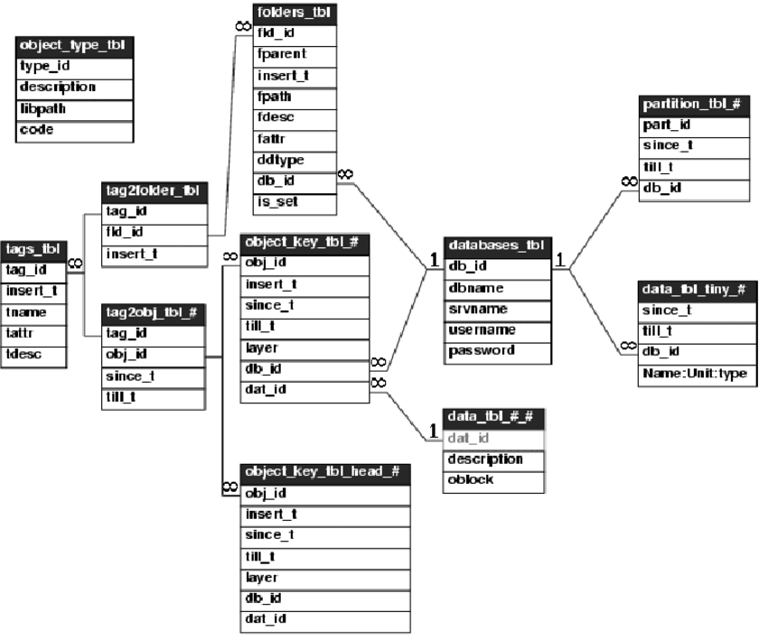
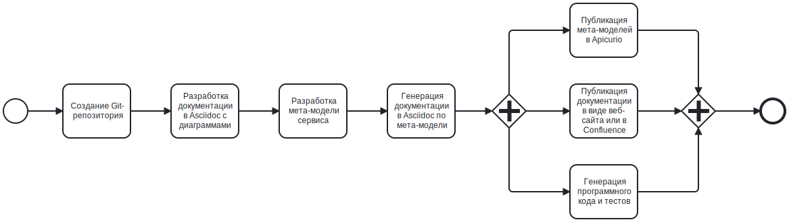
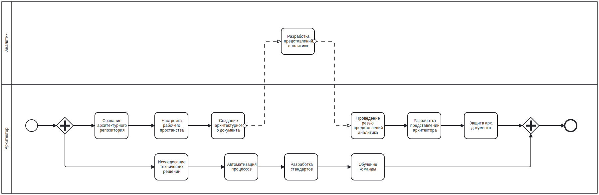

# ДОКУМЕНТАЦИЯ КАК КОД
:toc:
:toc-title: Содержание

## Цели доклада

1. Обзор подхода "Документация как код".

2. Обзор инструментов проектирования и документирования баз данных.

3. Обзор инструментов проектирования и документирования rest api.

4. Создание рабочей группы в рамках подхода "Архитектура как код".

## 1. Подходы к созданию документаци

### 1.1. WYSIWYG (what you see is what you get)

[quote]
----
Интерфейс, который позволяет редактировать контент так,
чтобы он в процессе работы выглядел практически так же,
как и конечный результат, документ или веб-страница.
----

#### 1.1.1. Преимущества подхода

* Низкий порог вхождения в технологии,
так как сразу виден конечный результат
(интуитивно понятный интерфейс редакторов).

#### 1.1.2. Недостатки подхода

* Требуются дорогостоящие сервера для обеспечения
совместной работы над документацией.

* Низкая производительность при работе
с большим объемом текста и графических изображений.

* Отсутствует возможность работать офлайн.

* Отсутствуют исходники графических изображений.

* Отсутствует возможность экспортировать и
импортировать документацию между проектами и окружениями.

* Большое количество рутинной работы при описании
сложных технических решений.

### 1.2. DOC AS CODE (документация как код)

[qoute]
----
Подход к разработке технической документации,
который подразумевает хранение требований и
архитектурных решений в виде текстовых файлов.
----

#### 1.2.1. Преимущества подхода

* Возможность разрабатывать большие по объему тексты без снижения производительности при публикации материалов.

* Возможно по отдельности работать над содержанием и оформлением документации.

* Возможность разрабатывать графические изображения в виде программного кода с последующей загрузкой в Confluence.

* Возможность отслеживать историю изменений документов и локально вести разработку без подключения к сети интернет.

* Возможность автоматизации генерации документации для снижения количества рутинной работы и ошибок в создаваемой документации.

* Все используемые инструменты для разработки документации полностью бесплатные.

#### 1.2.2. Недостатки подхода

* Высокий порог вхождения в стек технологий для технических специалистов с погружением в разработку программного кода.

* Наличие неявных ограничений технологий при создании текстового описания и графических изображений.

## 2. Языки разметки

*Верстка текста*

* HTML

* Wiki

* MarkDown

* *Asciidoc*

* Tex

*Верстка изображений*

* *Plantuml*

* Structurizr

* GraphViz

## 3. Проектирование enterprise-приложений

### 3.1. Слои архитектуры

#### 3.1.1. Презентация данных

* Экранные формы (Figma)

#### 3.1.2. Бизнес логика

* Варианты использования (Use-cases, Plantuml)

* Диаграммы последовательности (Sequences, Plantuml)

* Бизнес процессы (BPMN, Camunda)

#### 3.1.3. Модель данных

* Перечень сущностей (Entity, Models, ?)

* Атрибутивный состав (Attributes, Properties, ?)

* Открытые интерфейсы (Kafka, Rest, ?)

### 3.2. Code First

----
Сначала разрабатывается программное обеспечение, а после документация.

* Готовый софт частично сам себя опишет.
----

#### 3.2.1. Выгрузить DDL для описания таблиц БД

[source,sql]
----
CREATE TABLE Employees (
    employee_id INT PRIMARY KEY AUTO_INCREMENT,
    first_name VARCHAR(50) NOT NULL,
    last_name VARCHAR(50) NOT NULL,
    email VARCHAR(100) UNIQUE,
    hire_date DATE,
    department_id INT
);
----

#### 3.2.2. Приложить screenshot схемы базы данных

#### 3.2.3. Приложить ссылку на OpenAPI развернутого сервиса

http://localhost:8080/v3/api-docs/swagger-ui.html

https://example.com/v3/api-docs/swagger-ui.html

[source,bash]
----
curl http://localhost:8080/v3/api-docs/openapi.json
----

[source,bash]
----
curl http://example.com/v3/api-docs/openapi.json
----

#### 3.2.4. Преимущества Code First

----
"Рабочий софт важнее исчерпывающей документации"

Один из ключевых принципов Agile, означающий,
что главная цель — предоставить работающий
продукт заказчику как можно скорее, а не тратить
время на составление подробных документов до начала работы.
----

* Самый распространенный подход к ведению документации на рынке.

* Для разработки документации практически ничего не нужно делать.

* Самая актуальная документация - это программный код приложения.

#### 3.2.5. Недостатки Code First

* Отсутствует возможность что-то изменить, так как ресурсы на реализацию уже потрачены.

* Архитектурная документация всегда пытается догнать техническое решение.

* Отсутствует возможность изменить бинарные файлы со схемами.

* Отсутствует возможность доработки и интеграции без реверсивного инжиниринга.

* При возникновении инцидентов невозможно понять что произошло.

* При уходе технических специалистов из команды знания о продукты будут утеряны.

* Отсутствует возможность выполнять архитектурные тесты для текущей и целевой архитектуры.

* Накапливается технический долг, что приводит к неоправданной сложности технического решения.

* Через некоторое время для продолжения разработки сервиса нужен будет рестарт проекта.

### 3.3. Contract First

----
Сначата разработывается документация, после техническое решение.
----

#### 3.3.1. Преимущества подхода

* Возможность спроектировать техническое решение до его реализации.

* Ниже стоимость исправления ошибки на этапе проектирования.

* Архитектурная документация всегда находится в актуальном состоянии.

* Отсутствует потребность в консультациях со стороны разработчика приложения.

* Возможность автоматизированной генерации документации и программного кода приложения.

* Возможность автоматизированной генерации и выполнения архитектурных тестов приложения.

#### 3.3.2. Недостатки подхода

* Высокий порог вхождения в технологии.

* Встречаются баги и ограничения в инструментах.

#### 3.3.3. Контрактная разработка по мета-модели

*Список мета-моделей*

[cols="0,20,40,20,20"]
|===

|*№*
|*Название*
|*Описание*
|*ФОРМАТ*
|*СТАТУС*

|01.
|Liquibase
|Мета-модель для описания БД
|YAML, JSON
|ГОТОВО

|02.
|OpenAPI
|Мета-модель для описания Rest API
|YAML, JSON
|ГОТОВО

|03.
|AsyncAPI
|Мета-модель для описания очередей
|YAML, JSON
|В РАЗРАБОТКЕ

|===

#### 3.3.4. Описание процесса проектирования на мета-модели

#### 3.3.5. Целевая схема разделения труда между аналитиками и архитекторами

## 4. Используемый стек технологий

[cols="0,100"]
|===

|01.
|Git

|02.
|Java 21

|03.
|Apache Maven 3

|04.
|Plantuml

|05.
|https://www.jetbrains.com/idea/download/[IntelliJ IDEA (Community)]

|06.
|Plantuml Plugin (IntelliJ IDEA)

|07.
|Asciidoc Plugin (IntelliJ IDEA)

|08.
|Diagram.net Plugin (IntelliJ IDEA)

|09.
|Asciidoc

|10.
|asciidoctor-maven-plugin

|11.
|Confluence

|12.
|confluence-maven-plugin

|13.
|https://www.liquibase.com[Liquibase]

|14.
|liquibase-maven-plugin

|15.
|OpenAPI

|16.
|openapi-maven-plugin

|17.
|Apicurio

|18.
|apicurio-maven-plugin

|===

## 5. Организация рабочего пространства

### 5.1. Минимальная структура проекта

*Структура проекта*

----
/data/my-project/.git # Папка git-репозитория
/data/my-project/pom.xml # Проект Apache Maven
/data/my-project/src/main/asciidoc/index.adoc # Документ Asciidoc
----

.*pom.xml*
[%collapsible]
====
[source,xml]
----
<?xml version="1.0" encoding="UTF-8"?>
<project xmlns="http://maven.apache.org/POM/4.0.0"
         xmlns:xsi="http://www.w3.org/2001/XMLSchema-instance"
         xsi:schemaLocation="http://maven.apache.org/POM/4.0.0 http://maven.apache.org/xsd/maven-4.0.0.xsd">

    <modelVersion>4.0.0</modelVersion>

    <groupId>ru.volnenko.doc</groupId>
    <artifactId>my-project</artifactId>
    <version>1.0.0</version>
    <packaging>pom</packaging>

    <build>
        <plugins>
            <plugin>
                <groupId>org.asciidoctor</groupId>
                <artifactId>asciidoctor-maven-plugin</artifactId>
                <version>2.2.6</version>
                <executions>
                    <execution>
                        <id>convert-to-html</id>
                        <phase>generate-resources</phase>
                        <goals>
                            <goal>process-asciidoc</goal>
                        </goals>
                    </execution>
                </executions>
            </plugin>
        </plugins>
    </build>

</project>
----
====

.*index.adoc*
[%collapsible]
====
[source,asciidoc]
----
# Hello World!
----
====

### 5.2. Настройка публикации документации в Confluence

*Структура проекта*

----
/data/my-project/.git # Папка git-репозитория
/data/my-project/pom.xml # Проект Apache Maven
/data/my-project/src/main/asciidoc/index.adoc # Документ Asciidoc

/Users/username/.m2/settings.xml # Файл с настройками Apache Maven
----

.*pom.xml*
[%collapsible]
====
[source,xml]
----
<?xml version="1.0" encoding="UTF-8"?>
<project xmlns="http://maven.apache.org/POM/4.0.0"
         xmlns:xsi="http://www.w3.org/2001/XMLSchema-instance"
         xsi:schemaLocation="http://maven.apache.org/POM/4.0.0 http://maven.apache.org/xsd/maven-4.0.0.xsd">

    <modelVersion>4.0.0</modelVersion>

    <groupId>ru.volnenko.doc</groupId>
    <artifactId>my-project</artifactId>
    <version>1.0.0</version>
    <packaging>pom</packaging>

    <build>
        <plugins>
            <plugin>
                <groupId>org.asciidoctor</groupId>
                <artifactId>asciidoctor-maven-plugin</artifactId>
                <version>2.2.6</version>
                <executions>
                    <execution>
                        <id>convert-to-html</id>
                        <phase>generate-resources</phase>
                        <goals>
                            <goal>process-asciidoc</goal>
                        </goals>
                    </execution>
                </executions>
            </plugin>
        </plugins>
    </build>

</project>
----
====

.*settings.xml*
[%collapsible]
====
[source,xml]
----
<settings xmlns="http://maven.apache.org/SETTINGS/1.0.0"
          xmlns:xsi="http://www.w3.org/2001/XMLSchema-instance"
          xsi:schemaLocation="http://maven.apache.org/SETTINGS/1.0.0 https://maven.apache.org/xsd/settings-1.0.0.xsd">

    <servers>
        <server>
            <id>confluence</id>
            <username>test</username>
            <password>1234</password>
        </server>
    </servers>

</settings>
----
====

### 5.3. Настройка генерации документации базы данных

*Структура проекта*

----
/data/my-project/.git # Папка git-репозитория
/data/my-project/pom.xml # Проект Apache Maven
/data/my-project/src/main/asciidoc/archdoc.adoc # Документ Asciidoc
/data/my-project/src/main/resources/database/StatusType.yaml Описание перечисления "status_type"
/data/my-project/src/main/resources/database/Project.yaml Описание таблицы "app_project"
/data/my-project/src/main/resources/database/Task.yaml # Описание таблицы "app_task"

/data/my-project/src/main/asciidoc/database.adoc # Сгенерированное описание базы данных
/data/my-project/src/main/asciidoc/erd_logic.puml # Сгенерированная логическая схема в Plantuml
/data/my-project/src/main/asciidoc/erd_logic.svg # Скомпилированная логическая схема в SVG
/data/my-project/src/main/asciidoc/erd_physic.puml # Сгенерированная физическая схема в Plantuml
/data/my-project/src/main/asciidoc/erd_physic.svg # Скомпилированная физическая схема в SVG
/data/my-project/src/main/asciidoc/scheme.json # Скомпилированная мета-модель описания БД в JSON
/data/my-project/src/main/asciidoc/scheme.yaml # Скомпилированная мета-модель описания БД в YAML
----

.*Project.yaml*
[%collapsible]
====
[source,yaml]
----
---
databaseChangeLog:
  - changeSet:
      id: Project
      author: denis.volnenko
      changes:
        - createTable:
            schemaName: public
            catalogName: tm
            tableName: app_project
            remarks: Проект
            columns:
              - column:
                  name: id
                  type: uuid
                  autoIncrement: true
                  remarks: Уникальный код
                  constraints:
                    primaryKey: true
                    nullable: false
              - column:
                  name: name
                  type: text
                  remarks: Название
                  defaultValue: ""
                  constraints:
                    nullable: false
              - column:
                  name: description
                  type: text
                  remarks: Описание
                  defaultValue: ""
                  constraints:
                    nullable: false
              - column:
                  name: status_type
                  type: text
                  remarks: Статус
                  defaultValue: "NOT_STARTED"
                  constraints:
                    nullable: false
              - column:
                  name: created
                  type: timestampz
                  remarks: Дата создания
                  constraints:
                    nullable: false
              - column:
                  name: updated
                  type: timestampz
                  remarks: Дата обновления
                  constraints:
                    nullable: false
----
====

.*Task.yaml*
[%collapsible]
====
[source,yaml]
----
---
databaseChangeLog:
- changeSet:
    id: Task
    author: denis.volnenko
    changes:
      - createTable:
          schemaName: public
          catalogName: tm
          tableName: app_task
          remarks: Задачи
          columns:
            - column:
                name: id
                type: uuid
                remarks: Уникальный код
                autoIncrement: true
                constraints:
                  primaryKey: true
                  nullable: false
            - column:
                name: name
                type: text
                remarks: Название
                defaultValue: ""
                constraints:
                  nullable: false
            - column:
                name: description
                type: text
                remarks: Описание
                defaultValue: ""
                constraints:
                  nullable: false
            - column:
                name: status_type
                type: text
                remarks: Статус
                defaultValue: "NOT_STARTED"
                constraints:
                  nullable: false
            - column:
                name: project_id
                type: uuid
                remarks: Код проекта
                constraints:
                  foreignKey:
                    referencedColumnNames: id
                    referencedTableName: app_project
                  nullable: false
            - column:
                name: created
                type: timestampz
                remarks: Дата создания
                constraints:
                  nullable: false
            - column:
                name: updated
                type: timestampz
                remarks: Дата обновления
                constraints:
                  nullable: false
----
====

.*StatusType.yaml*
[%collapsible]
====
[source,yaml]
----
---
databaseChangeLog:
- changeSet:
    id: StatusType
    author: denis.volnenko
    changes:
      - createType:
          schemaName: public
          catalogName: tm
          typeName: status_type
          remarks: Статус
          values:
            - value:
                name: NOT_STARTED
                remarks: Не начато
            - value:
                name: IN_PROGRESS
                remarks: В процессе
            - value:
                name: COMPLETE
                remarks: Завершено
----
====

.*pom.xml*
[%collapsible]
====
[source,xml]
----
<?xml version="1.0" encoding="UTF-8"?>
<project xmlns="http://maven.apache.org/POM/4.0.0"
         xmlns:xsi="http://www.w3.org/2001/XMLSchema-instance"
         xsi:schemaLocation="http://maven.apache.org/POM/4.0.0 http://maven.apache.org/xsd/maven-4.0.0.xsd">

    <modelVersion>4.0.0</modelVersion>

    <groupId>ru.volnenko.doc</groupId>
    <artifactId>my-project</artifactId>
    <version>1.0.0</version>
    <packaging>pom</packaging>

    <build>
        <plugins>
           <plugin>
                <groupId>ru.volnenko.maven.plugin</groupId>
                <artifactId>liquilbase-asciidoc-maven-plugin</artifactId>
                <version>1.0.0</version>
                <configuration>
                    <serviceName>Task Manager</serviceName>
                    <dataBaseInfo>Postgres 15</dataBaseInfo>
                    <headerFirstEnabled>false</headerFirstEnabled>
                    <headerSecondEnabled>true</headerSecondEnabled>
                    <tableOfContentsEnabled>true</tableOfContentsEnabled>
                    <outputPath>${project.basedir}/src/main/asciidoc</outputPath>
                    <outputFile>database.adoc</outputFile>
                    <outputJsonFileEnabled>true</outputJsonFileEnabled>
                    <outputYamlFileEnabled>true</outputYamlFileEnabled>
                    <files>
                        <file>${project.basedir}/src/main/resources/database/StatusType.yaml</file>
                        <file>${project.basedir}/src/main/resources/database/Project.yaml</file>
                        <file>${project.basedir}/src/main/resources/database/Task.yaml</file>
                    </files>
                </configuration>
            </plugin>
            <plugin>
                <groupId>org.asciidoctor</groupId>
                <artifactId>asciidoctor-maven-plugin</artifactId>
                <version>2.2.6</version>
                <executions>
                    <execution>
                        <id>convert-to-html</id>
                        <phase>generate-resources</phase>
                        <goals>
                            <goal>process-asciidoc</goal>
                        </goals>
                    </execution>
                </executions>
            </plugin>
        </plugins>
    </build>

</project>
----
====

.*archdoc.adoc*
[%collapsible]
====
[source,asciidoc]
----
 # АРХИТЕКТУРНЫЙ ДОКУМЕНТ
 :toc:
 :toc-title: Содержание

 include::database.adoc[]
----
====

### 5.4. Настройка генерации документации rest api

*Структура проекта*

----
/data/my-project/.git # Папка git-репозитория
/data/my-project/pom.xml # Проект Apache Maven
/data/my-project/src/main/asciidoc/archdoc.adoc # Документ Asciidoc
/data/my-project/src/main/resources/openapi/OpenAPI.yaml # Контекст OpenAPI
/data/my-project/src/main/resources/openapi/model/ErrorDto.yaml # Модель ErrorDto
/data/my-project/src/main/resources/openapi/model/ProjectDto.yaml # Модель ProjectDto
/data/my-project/src/main/resources/openapi/model/TaskDto.yaml # Модель TaskDto
/data/my-project/src/main/resources/openapi/path/ProjectSelectAll.yaml # Метод получения всех проектов
/data/my-project/src/main/resources/openapi/path/ProjectSelectOne.yaml # Метод получения проекта по id
/data/my-project/src/main/resources/openapi/path/TaskSelectAll.yaml # Метод получения всех задач
/data/my-project/src/main/resources/openapi/path/TaskSelectOne.yaml # Метод получения задачи по id

/data/my-project/src/main/asciidoc/openapi.adoc # Сгенерированное описание OpenAPI
/data/my-project/src/main/asciidoc/openapi.json # Скомпилированный контракт OpenAPI в JSON
/data/my-project/src/main/asciidoc/openapi.yaml # Скомпилированный контракт OpenAPI в YAML
/data/my-project/src/main/asciidoc/openapi.js # Скомпилированный контракт OpenAPI в JS
----

.*OpenAPI.yaml*
[%collapsible]
====
[source,yaml]
----
---
openapi: 3.0.4
info:
  title: Task Manager
servers:
  - url: https://tm.volnenko.ru/api/
----
====

.*ErrorDto.dto*
[%collapsible]
====
[source,yaml]
----
components:
  schemas:
    ErrorDto:
      type: object
      description: Ошибка
      required:
        - success
      properties:
        success:
          type: boolean
          description: Результат выполнения
        message:
          type: string
          description: Сообщение об ошибке
        errorCode:
          type: string
          description: Код ошибки
----
====

.*ProjectDto.yaml*
[%collapsible]
====
[source,yaml]
----
components:
  schemas:
    ProjectDto:
      type: object
      description: Проект
      required:
        - id
        - name
        - description
        - statusType
        - created
        - updated
      properties:
        id:
          type: string
          format: uuid
          description: Идентификатор
        name:
          type: string
          description: Название
        description:
          type: string
          description: Описание
        statusType:
          type: string
          description: Статус
          enum:
            - NOT_STARTED
            - IN_PROGRESS
            - COMPLETE
        created:
          type: string
          format: iso8601
          description: Дата создания
        updated:
          type: string
          format: iso8601
          description: Дата создания
----
====

.*TaskDto.yaml*
[%collapsible]
====
[source,yaml]
----
components:
  schemas:
    TaskDto:
      type: object
      description: Задача
      required:
        - id
        - name
        - description
        - statusType
        - created
        - updated
      properties:
        id:
          type: string
          format: uuid
          description: Идентификатор
        name:
          type: string
          description: Название
        description:
          type: string
          description: Описание
        statusType:
          type: string
          description: Статус
          enum:
            - NOT_STARTED
            - IN_PROGRESS
            - COMPLETE
        created:
          type: string
          format: iso8601
          description: Дата создания
        updated:
          type: string
          format: iso8601
          description: Дата создания
----
====

.*archdoc.adoc*
[%collapsible]
====
[source,asciidoc]
----
 # АРХИТЕКТУРНЫЙ ДОКУМЕНТ
 :toc:
 :toc-title: Содержание

 include::openapi.adoc[]
----
====

== Пример описания базы данных

include::page-database.adoc[]

== Пример описания веб-сервисов
