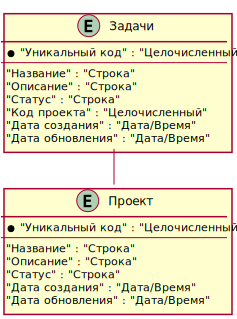
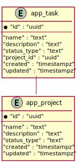

= Task Manager
:toc-title: Оглавление
:toc:

== Представление данных

=== Логическая ER-диаграмма базы данных 

 

=== Физическая ER-диаграмма базы данных 

 

=== Сущность "app_project"

==== Общие сведения

[cols="20,80"]
|===

|*Физ. название*:
|app_project

|*Лог. название*:
|Проект

|*Сервис*:
|Task Manager

|*База данных*:
|tm

|*Доп. сведения*:
|Postgres 15

|*Схема*:
|public

|===

==== Описание полей

[cols="0,20,20,20,5,5,5,5,5,10"]
|===

^|*№*
|*Физ. название*
|*Тип*
|*Лог. название*
^|*PK*
^|*UK*
^|*FK*
^|*AI*
^|*NN*
|*DEFAULT*

^|01. 
|id
|uuid
|Уникальный код
^|✓
^|--
^|--
^|✓
^|✓
|

^|02. 
|name
|text
|Название
^|--
^|--
^|--
^|--
^|✓
|

^|03. 
|description
|text
|Описание
^|--
^|--
^|--
^|--
^|✓
|

^|04. 
|status_type
|text
|Статус
^|--
^|--
^|--
^|--
^|✓
|NOT_STARTED

^|05. 
|created
|timestampz
|Дата создания
^|--
^|--
^|--
^|--
^|✓
|

^|06. 
|updated
|timestampz
|Дата обновления
^|--
^|--
^|--
^|--
^|✓
|

|===

=== Сущность "app_task"

==== Общие сведения

[cols="20,80"]
|===

|*Физ. название*:
|app_task

|*Лог. название*:
|Задачи

|*Сервис*:
|Task Manager

|*База данных*:
|tm

|*Доп. сведения*:
|Postgres 15

|*Схема*:
|public

|===

==== Описание полей

[cols="0,20,20,20,5,5,5,5,5,10"]
|===

^|*№*
|*Физ. название*
|*Тип*
|*Лог. название*
^|*PK*
^|*UK*
^|*FK*
^|*AI*
^|*NN*
|*DEFAULT*

^|01. 
|id
|uuid
|Уникальный код
^|✓
^|--
^|--
^|✓
^|✓
|

^|02. 
|name
|text
|Название
^|--
^|--
^|--
^|--
^|✓
|

^|03. 
|description
|text
|Описание
^|--
^|--
^|--
^|--
^|✓
|

^|04. 
|status_type
|text
|Статус
^|--
^|--
^|--
^|--
^|✓
|NOT_STARTED

^|05. 
|project_id
|uuid
|Код проекта
^|--
^|--
^|✓
^|--
^|✓
|

^|06. 
|created
|timestampz
|Дата создания
^|--
^|--
^|--
^|--
^|✓
|

^|07. 
|updated
|timestampz
|Дата обновления
^|--
^|--
^|--
^|--
^|✓
|

|===

=== Перечисление "status_type"
==== Общие сведения

[cols="20,80"]
|===

|*Физ. название*:
|status_type

|*Лог. название*:
|Статус

|*Сервис*:
|Task Manager

|*База данных*:
|tm

|*Доп. сведения*:
|Postgres 15

|*Схема*:
|public

|===

==== Описание значений 

[cols="0,30,70"]
|===

^|*№*
|*Физ. название*
|*Лог. название*

^|01. 
|NOT_STARTED
|Не начато

^|02. 
|IN_PROGRESS
|В процессе

^|03. 
|COMPLETE
|Завершено

|===

